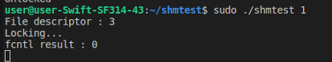
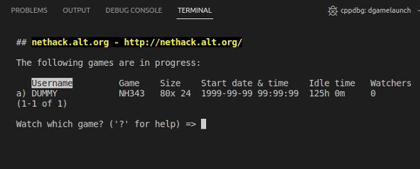
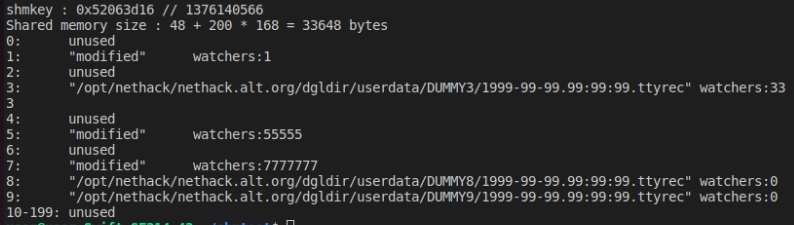
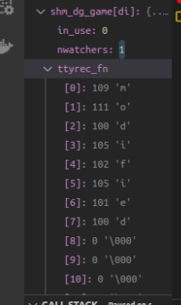
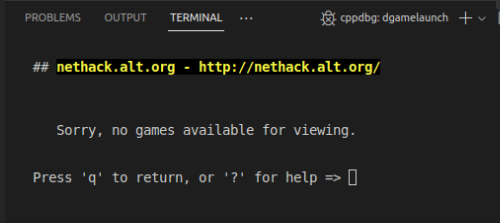
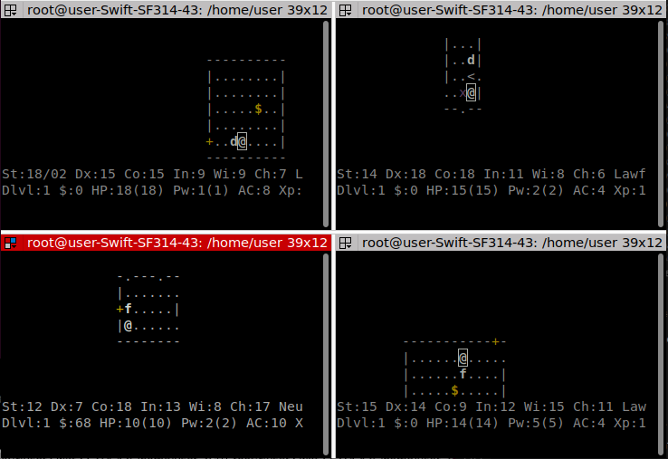
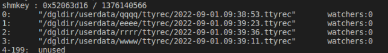
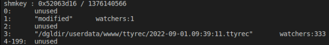
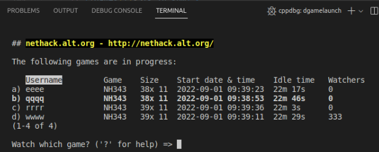

# Webtiles -> dgamelaunch 정보 공유 방법
    Webtiles에서 플레이 중인 게임 정보를 dgamelaunch 프로세스들에게 알리려면
    dgamelaunch 프로세스끼리 게임 정보를 공유하는 기능이 이미 있기 때문에 이 기능을 활용하면 된다.
    
    dgamelaunch에서는 파일과 공유 메모리를 통해 게임 정보를 공유한다.
    Webtiles의 게임 정보를 공유하려면 최소한 아래의 과정이 필요하다.

    1. dgamelaunch와 Webtiles가 같은 ttyrec 경로를 바라보게 한다.
    2. Webtiles에서 생성된 파일이 dgamelaunch에서 잘 열리는지 확인한다.
    3. fcntl로 쓰기 락을 걸어서 게임이 현재 플레이 중이라는 것을 다른 dgamelaunch 프로세스가 알 수 있도록 한다.
    4. 공유 메모리로 관전자 수 등 ttyrec 파일에서 얻을 수 없는 정보들을 공유한다.

 

# shmtest : 가짜 목록 공유 프로그램
## 컴파일
    make

 

## 실행
    sudo ./shmtest [1~3]

 

## 테스트 시나리오
### 1. 더미 파일로 만든 가짜 목록을 dgamelaunch가 읽도록 한다.

- 더미 파일을 inprogress 경로에 복사하고 fcntl로 쓰기 잠금을 건다.
 </img> 

- 공유 메모리를 조작하지 않아도 파일만 있으면 dgamelaunch는 플레이 중인 게임이라고 인식한다.
 </img> 

### 2. 파일 없이 공유 메모리만 생성하여 dgamelaunch가 정보를 읽도록 한다.
- 공유 메모리에 데이터를 10개 만들고  
    0, 2, 4, 6번 항목은 삭제,  
    1, 5, 7번 항목은 ttyrec 파일 경로를 "modified"로 수정,  
    3번 항목은 관전자 수를 333으로 수정한다.  
 </img> 

- dgamelaunch에서 변경된 공유 메모리를 읽어온 것이 확인되었지만 
 </img> 

- ttyrec 경로에 실제로 파일이 없다면 플레이 중인 게임이라고 인식하지 않는다.
 </img> 

### 3. dgamelaunch가 생성한 공유 메모리를 조작한다.

- 4개의 dgamelaunch 프로세스로 각각 게임을 실행한다.
 </img> 

- 공유 메모리에 4개의 게임 정보가 들어가 있다.
 </img> 

- 0, 2번 항목은 삭제, 
    1번 항목은 ttyrec 파일 경로를 "modified"로 수정, 
    3번 항목은 관전자 수를 333으로 수정한다. 
 </img> 

- 공유 메모리를 조작해서 항목을 삭제하고 잘못된 정보로 변경하더라도 
    파일에서 읽은 정보가 있으므로 제대로 된 정보가 공유 메모리에 유지된다. 
    0, 1, 2번 항목은 파일에서 읽어온 정보로 최신화되었고 
    3번 목록의 관전자 수가 바뀐 모습을 확인할 수 있다. 
 </img> 
