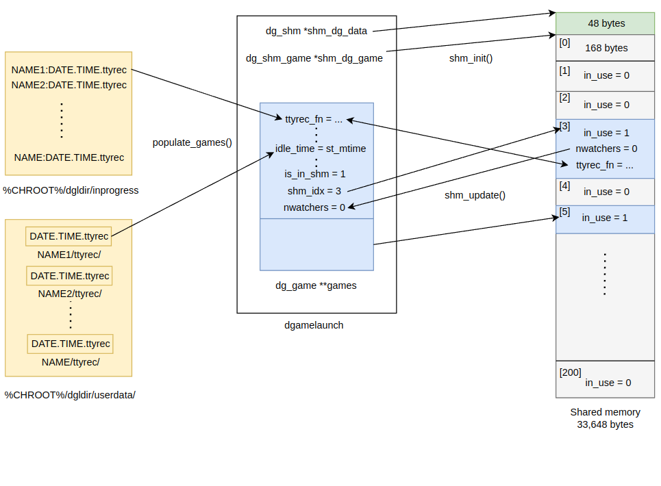

# dgamelaunch의 플레이 중인 게임 목록 공유 기능
    관전 기능을 실행하면 무한 루프를 돌면서
    키 입력이 발생할 때마다 아래의 동작을 반복하며
    화면에 현재 플레이 중인 게임 목록을 최신화한다.

 </img> 
 

# 1. 공유 메모리와 연결
## 1.1 IPC 키 생성
    공유 메모리와 세마포어를 사용하기 위해 IPC(Inter-Process Communication)키를 생성한다.
    ftok(file-to-key)의 매개변수에 들어가는 경로에 해당하는 파일이 실제로 있어야 하며
    같은 파일로 생성한 키는 모든 프로세스에서 같은 값을 가진다.

## 1.2 공유 메모리 연결
    공유 메모리가 이미 있다면 그 메모리를 사용한다.
    공유 메모리가 없다면 직접 생성 후 초기화한다.
    공유 메모리의 구역을 나눠서 서로 다른 구조체 포인터가 가리키게 한다.

## 1.3 임계영역 접근 제어
    공유 메모리에 접근할 때 마다 공통된 동작을 한다.
    시그널을 블록해서 공유 메모리 접근 도중에는 시그널을 받지 않도록 한다.
    세마포어를 통해 임계영역에 한번에 한 프로세스만 접근할 수 있도록 한다.

 

# 2. 플레이 중이 아닌 게임 파일 삭제
    inprogress 경로의 ttyrec 파일에
    fcntl(file-control)에 의한 쓰기 잠금이 걸려있지 않다면
    플레이 중이 아닌 게임으로 인식하여 파일을 삭제한다.

 

# 3. 파일로부터 플레이 중인 게임 정보 얻기
## 3.1. inprogress 경로의 ttyrec 파일
    파일명을 파싱해 userdata 파일 경로를 찾고
    파일 내용에서 pid, ws_row, ws_col 정보를 얻는다.
    추가로 쓰기 잠금이 걸려있는지 확인하여 게임이 현재 플레이 중인지 확인하는 용도로 쓰인다.

## 3.2. userdata 경로의 ttyrec 파일
    파일명을 파싱해 플레이어 닉네임, 게임 시작 날짜와 시간을 얻고
    파일 속성에서 마지막 수정 시간을 통해 idle_time을 얻는다.
    파일 경로는 공유 메모리에 있는 데이터와 현재 프로세스가 가진 게임 데이터가 같은지 식별할 때 쓰인다.

 

# 4. 파일에서 읽은 게임 정보 배열과 공유 메모리 정보 동기화
## 4.1 공유 메모리 -> 게임 정보 배열
    관전자 수를 얻어와 최신화한다. (nwatchers)
    게임 데이터가 공유 메모리에 있다고 표시 (is_in_shm)
    게임 데이터가 공유 메모리에 어느 인덱스에 위치한다고 표시 (shm_idx)

 

## 4.2 게임 정보 배열 -> 공유 메모리
### 4.2.1 삭제
    inprogress 파일이 없다는 것은 게임이 현재 플레이되고 있지 않다는 의미이므로
    공유 메모리에만 존재하는 게임 정보를 만료된 것으로 취급하여 삭제한다.
    (실제로 메모리에서 지우지 않고 in_use값을 0으로 해서 쓰지 않는다고 표시만 해둔다.)
### 4.2.2 추가
    플레이 중인 게임이지만 공유 메모리에 없는 게임 정보를
    공유 메모리에 올려서 다른 프로세스가 알 수 있도록 한다.

 
